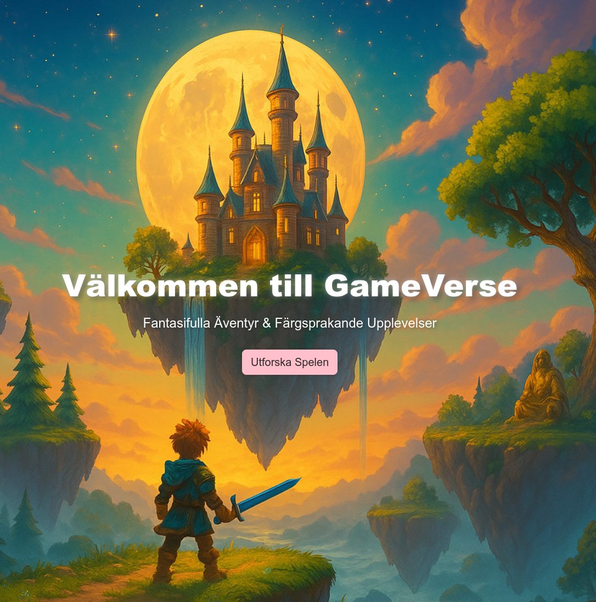

# 🎮 GameVerse v1 – Lär dig webbsårbarheter

**GameVerse v1** är en sårbar testapplikation utvecklad i Node.js/Express med SQLite. Gameverse är skapad i utbildningssyfte för nybörjare inom webb- och applikationssäkerhet. Syftet är att låta elever öva upptäckt och exploatering av vanliga sårbarheter i en säker miljö.



> Denna applikation är avsiktligt osäker. Kör den **inte** i en publik miljö.

---

## Funktioner

- Registrering och inloggning med JWT
- Skapa och visa forumtrådar
- Användarroller (user/admin)
- Minimal frontend med `public/`-katalog

---

##  Inbyggda sårbarheter

Följande sårbarheter finns avsiktligt inbyggda i applikationen:

<details>
<summary> <strong>Mass Assignment</strong></summary>

Vid registrering går det att specificera `role`, vilket gör att man kan skapa admin-användare. Dock har detta ingen effekt om rollbaserad åtkomst inte används rätt.

</details>

<details>
<summary> <strong>SQL Injection</strong></summary>

Login använder icke-parameteriserade SQL-queries:

```sql
SELECT * FROM users WHERE username = 'användare' AND password = 'lösenord'
```

</details> <details> <summary> <strong>Broken Authentication</strong></summary>

JWT-token signeras med en hårdkodad och svag nyckel (supersecretkey), vilket gör den sårbar för bruteforce.
</details> <details> <summary> <strong>IDOR</strong></summary>

Alla användare kan ta bort trådar via /threads/:id, oavsett om de äger tråden eller inte.
</details> <details> <summary> <strong>Brute-force Protection</strong></summary>

Det finns inget skydd mot upprepade inloggningsförsök – ingen rate limiting, CAPTCHA eller lockout.
</details> <details> <summary> <strong>Insecure Authorization</strong></summary>

Vid trådskapande används username från klienten istället för att hämta det från den autentiserade JWT-token. Det möjliggör att t.ex. skapa trådar som annan användare.
</details>

<details> <summary> <strong>XSS</strong></summary>

Det finns i princip ingen sanering av user generated content.
</details>

---

## Kom igång

### Kör med Node.js (lokalt)

```bash
git clone https://github.com/ettelman/gameverse_v1
cd gameverse
npm install
node server.js
Gå in på http://localhost:3300
```

### Kör med Docker

```Bash
git clone https://github.com/ettelman/gameverse_v1
cd gameverse
docker build -t gameverse .
docker run -p 3300:3300 gameverse
Gå in på http://localhost:3300
```
